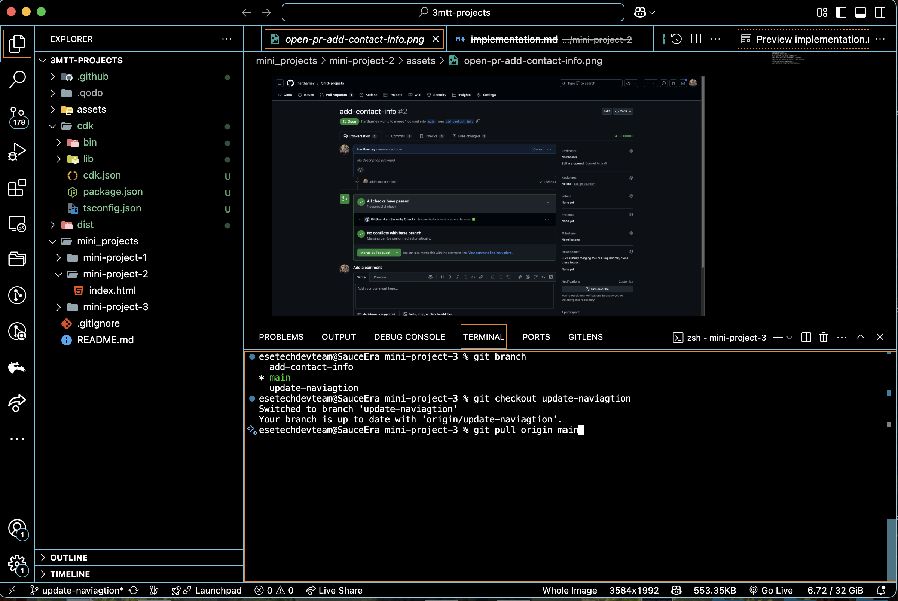
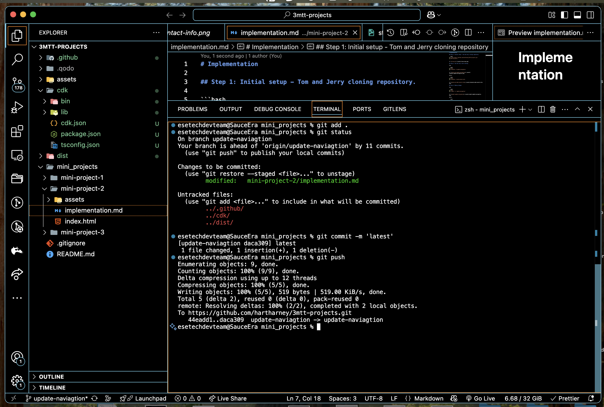
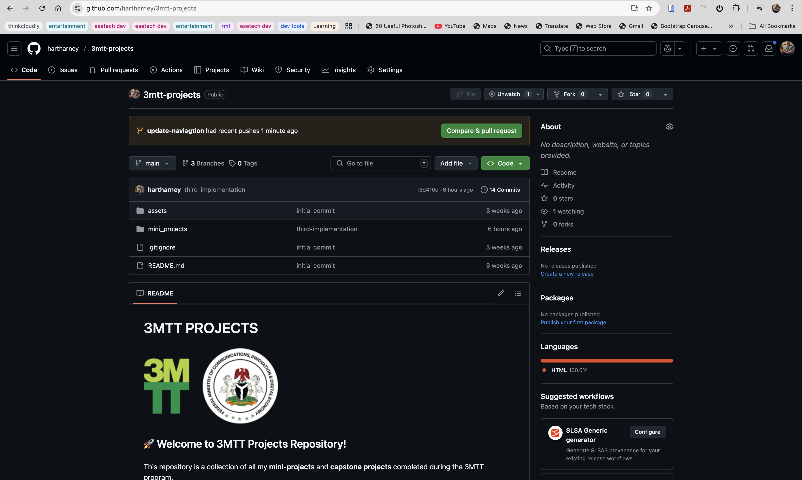
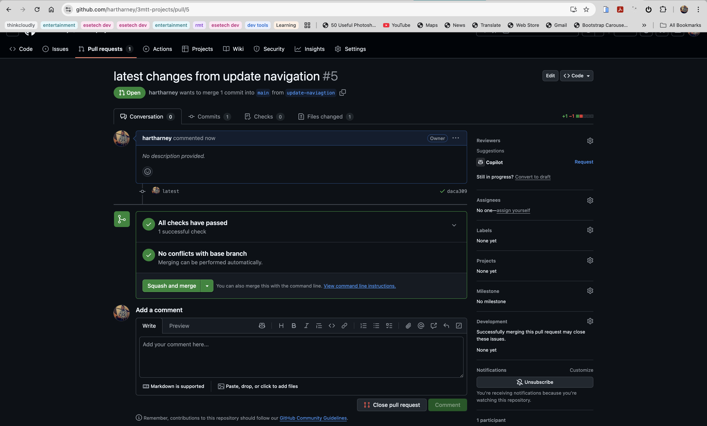
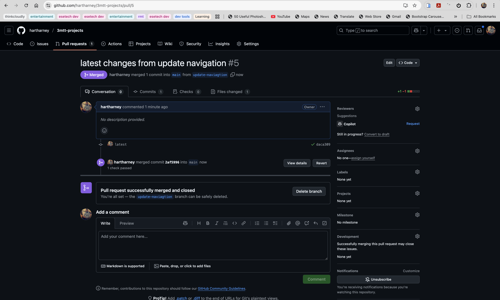
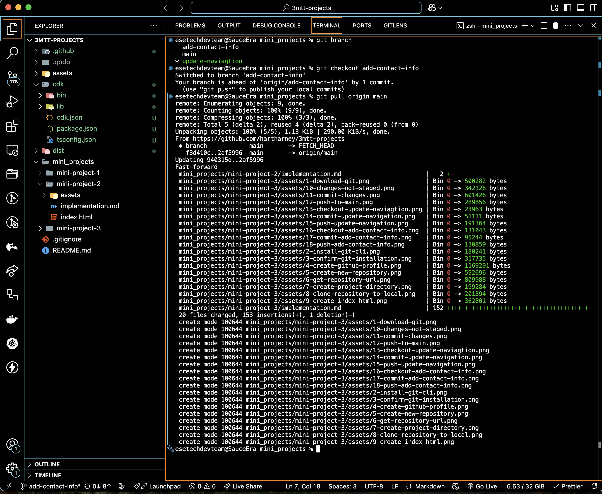
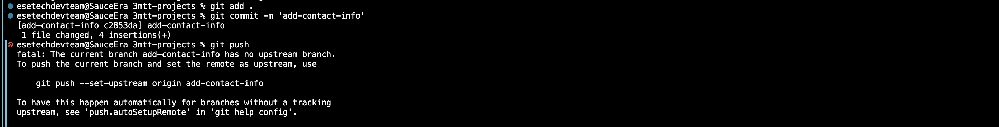
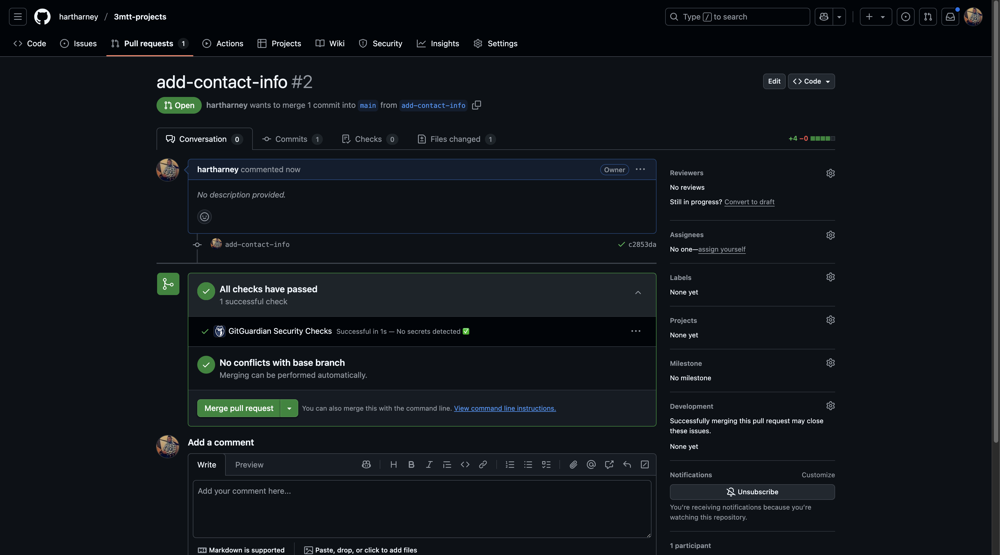

# Implementation

## Step 1: Checkout update naviagtion

```bash
git checkout  update-naviagtion
git pull origin main
```

🔗 

## Step 2: Commit Toms work

```bash
git add .
git commit -m latest
```



## Step 3: push changes from Toms work

```bash
git push
```

🔗 

## Step 4: Raise pr for Toms work

🔗 

## Step 5: Review Toms work on github

🔗 

## Step 6: Merging Toms work into main

🔗 

## Step 7: Update Jerrys work

```bash
git pull origin main
```

🔗 

## Step 8: Commit Jerrys work

```bash
git add .
git commit -m 'add-contact-info'
```

🔗 

## Step 9: Push Jerrys work

```bash
git push --set-upstream origin add-contact-info
```

🔗 

## Step 9: Review jerrys work

🔗 
