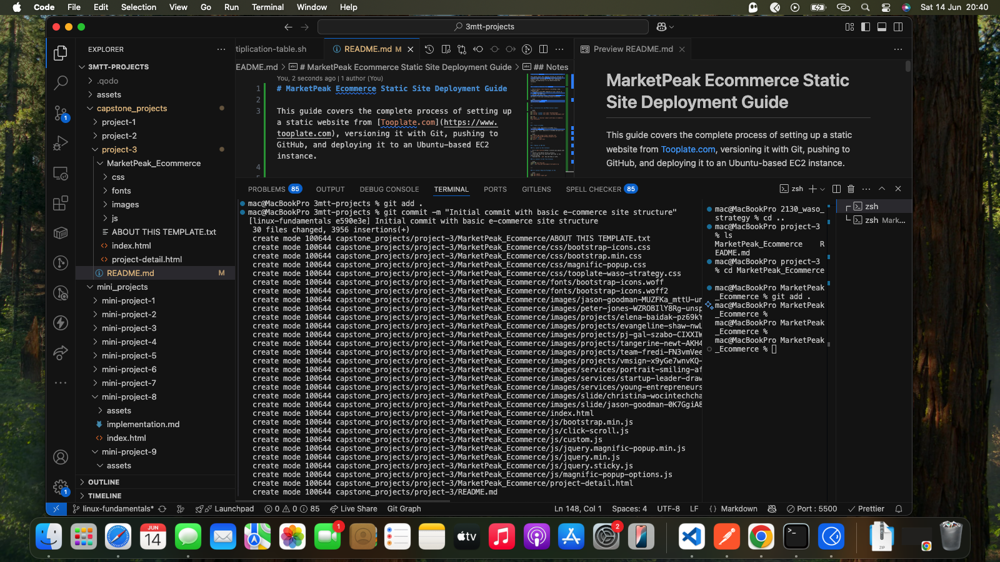
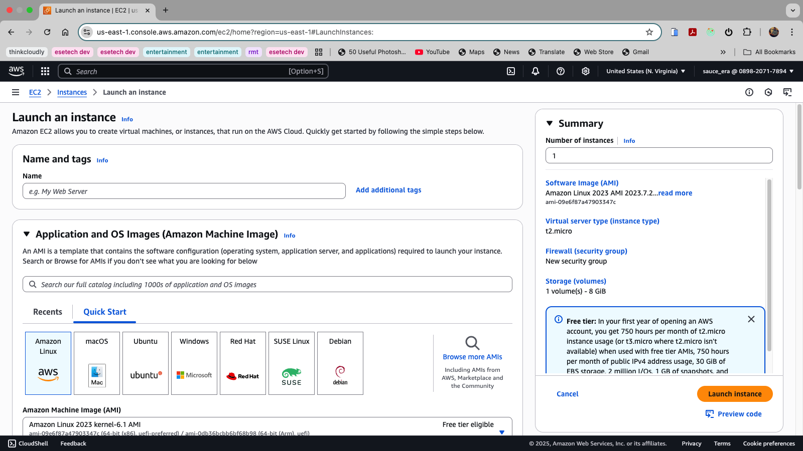

# MarketPeak Ecommerce Static Site Deployment Guide

This guide covers the complete process of setting up a static website from [Tooplate.com](https://www.tooplate.com), versioning it with Git, pushing to GitHub, and deploying it to an Ubuntu-based EC2 instance.

---

## 1. Clone a Template from Tooplate

1. Go to [https://www.tooplate.com](https://www.tooplate.com)
2. Download a free HTML template of your choice (e.g., _Waso Strategy_).
3. Extract the ZIP file.
4. Rename the folder (e.g., `MarketPeak_Ecommerce`) and move it into your working project directory.

```bash
mkdir MarketPeak_Ecommerce
cd MarketPeak_Ecommerce
```

---

## 2. Initialize Git and Make Initial Commit

```bash
git init
git config --global user.name "YourUsername"
git config --global user.email "youremail@example.com"

git add .
git commit -m "Initial commit with basic e-commerce site structure"
```



---

## 3. Push to GitHub

1. Create a new repository on GitHub (e.g., `MarketPeak_Ecommerce`)
2. Link your local repository to GitHub and push your changes:

```bash
git remote add origin https://github.com/your-git-username/MarketPeak_Ecommerce.git
git branch -M main
git push -u origin main
```

---

## 4. Deploy on AWS EC2

### 4.1 Launch an EC2 Instance

1. Go to [EC2 Console](https://console.aws.amazon.com/ec2/)
2. Launch a new Ubuntu Server instance.
3. Allow SSH (port 22) and HTTP (port 80) in the security group.
4. Download the `.pem` key and keep it safe.



### 4.2 Connect to EC2 from Terminal

```bash
chmod 400 your-key.pem
ssh -i your-key.pem ubuntu@your-ec2-public-ip
```

---

### 4.3 Install Required Packages on EC2

```bash
sudo apt update
sudo apt install nginx git
```

---

### 4.4 Clone the GitHub Repository

```bash
cd /var/www
sudo git clone https://github.com/your-git-username/MarketPeak_Ecommerce.git
sudo chown -R www-data:www-data MarketPeak_Ecommerce
```

---

### 4.5 Configure Nginx

```bash
sudo nano /etc/nginx/sites-available/marketpeak
```

Paste the following configuration:

```nginx
server {
    listen 80;
    server_name your-ec2-public-ip;

    root /var/www/MarketPeak_Ecommerce;
    index index.html;

    location / {
        try_files $uri $uri/ =404;
    }
}
```

Enable the site and reload Nginx:

```bash
sudo ln -s /etc/nginx/sites-available/marketpeak /etc/nginx/sites-enabled/
sudo nginx -t
sudo systemctl reload nginx
```

---

## 5. Test the Deployment

- Open a browser and visit: `http://your-ec2-public-ip`
- You should see your Tooplate template running live.

---

## 6. Update Deployment (when changes are made)

Whenever you update the site:

```bash
# On your local machine
git add .
git commit -m "Update content or assets"
git push

# Then on the EC2 server
cd /var/www/MarketPeak_Ecommerce
sudo git pull
sudo systemctl reload nginx
```

---


## Notes

- You do not need Node.js or backend frameworks for this deployment since it is a static site.
- You can replace `your-ec2-public-ip` with your domain name if you set one up.
- Make sure your security group allows traffic on port 80 (HTTP).

---
