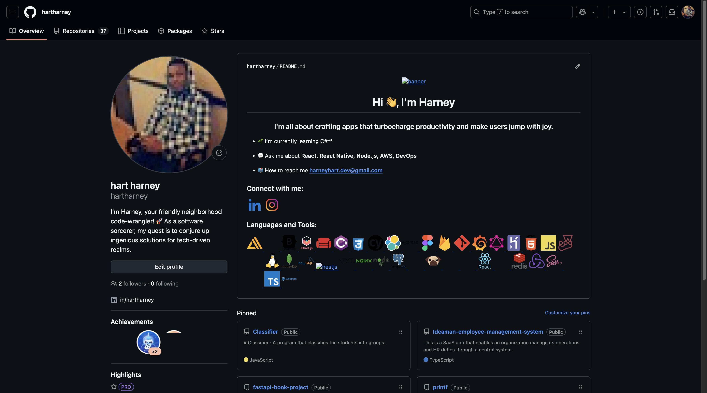
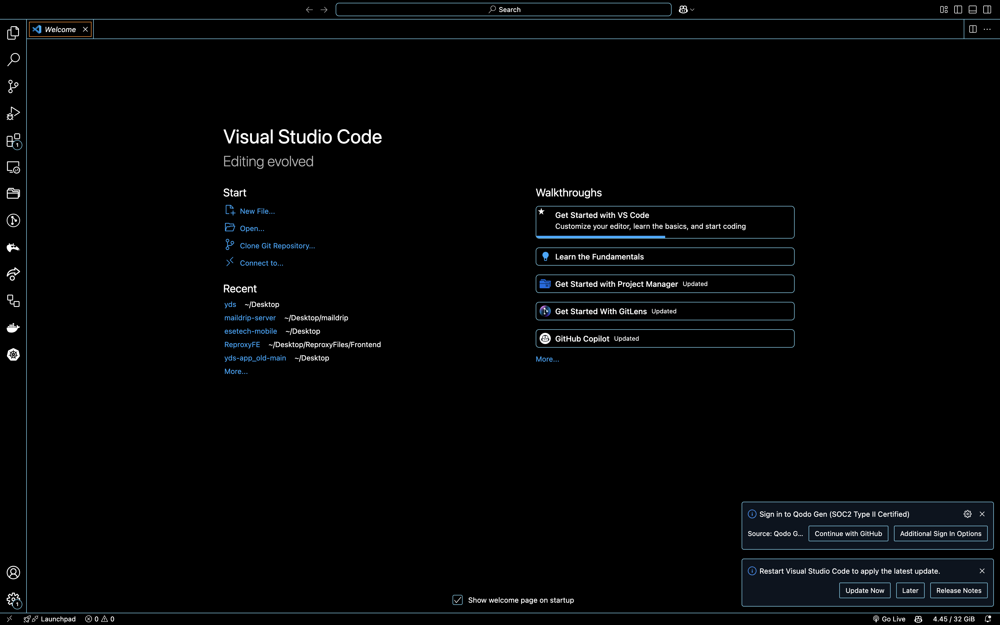
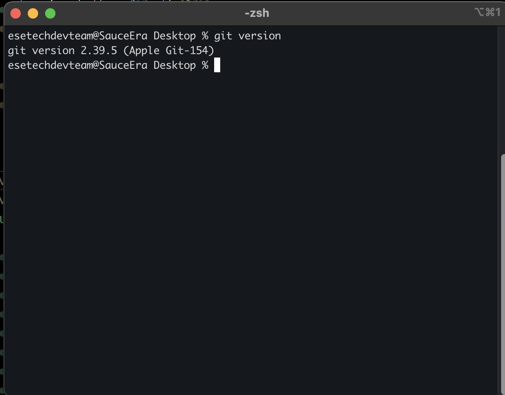
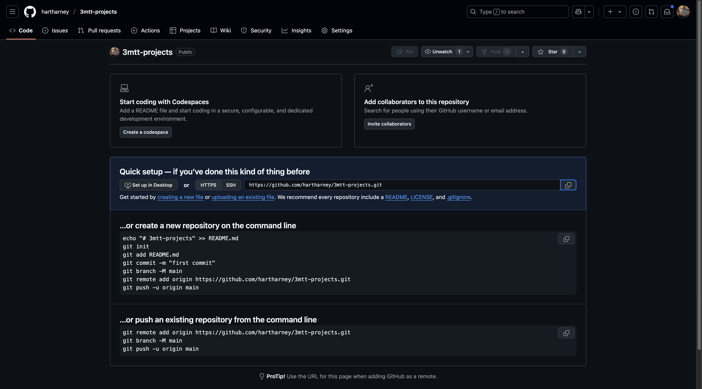
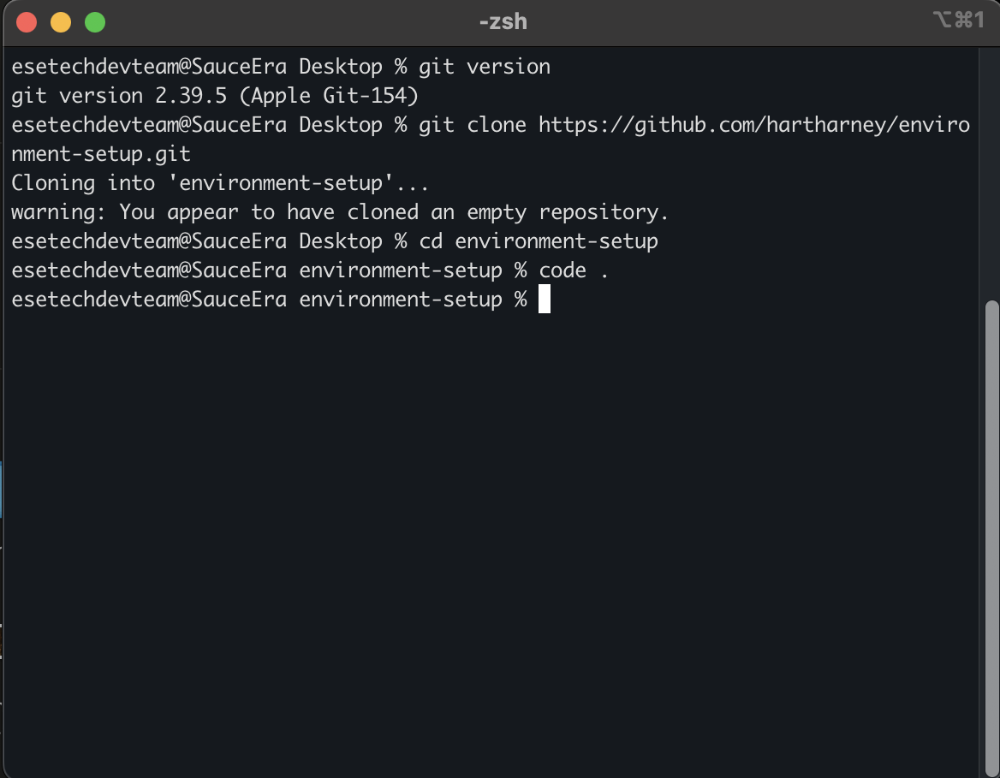
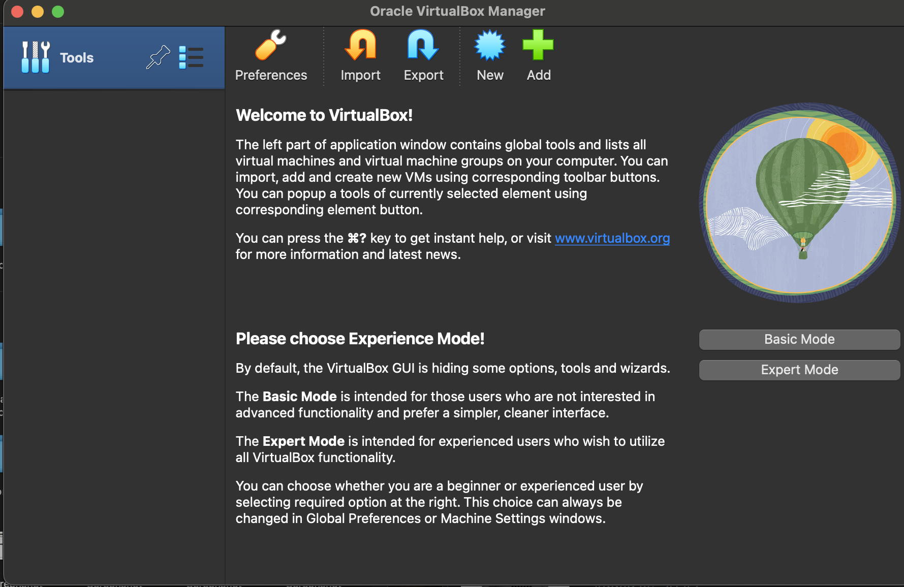
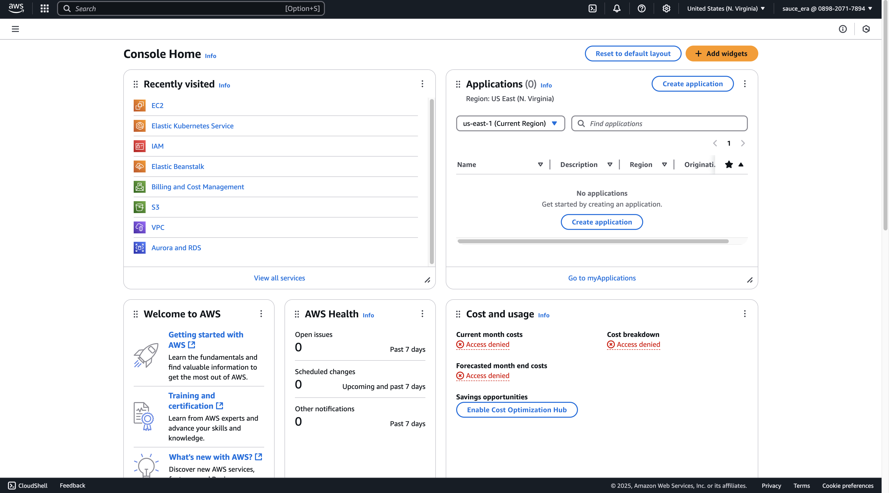
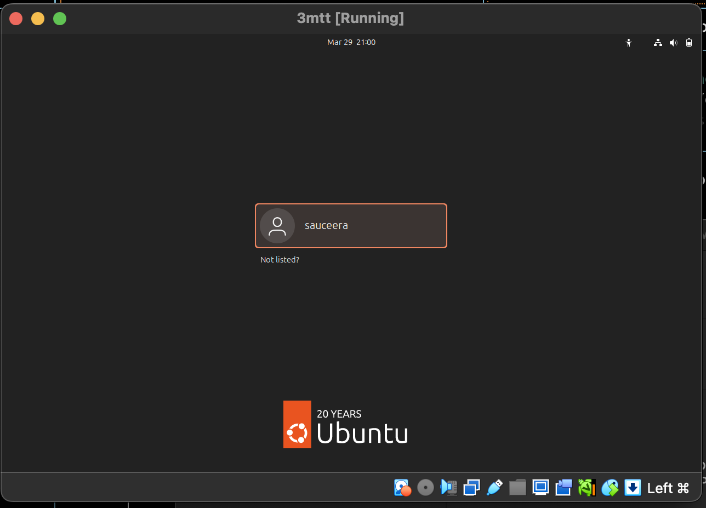

# Implementation

## Step 1: Create a GitHub Account

Create a GitHub account by visiting the link below:

🔗 [My GitHub Account](https://github.com/hartharney/3mtt-projects)



---

## Step 2: Download and Install VS Code for macOS

Download Visual Studio Code from the official website:

🔗 [Visual Studio Code Official Website](https://code.visualstudio.com/)

After downloading, install and launch VS Code.



---

## Step 3: Install Git on Your Machine

1. Download Git from the official website:

   🔗 [Git Official Website](https://git-scm.com/downloads)

2. Install Git following the provided instructions for your OS.
3. Confirm the installation by running the following command:

   ```bash
   git --version
   ```

If Git is successfully installed, the version number will be displayed.



---

## Step 4: Create a Repository on GitHub

Follow these steps to create a new repository:

1. Visit 🔗 [GitHub](https://github.com)
2. Navigate to your profile.
3. Click on **Repositories**.
4. Click on **New** to create a repository.
5. Choose a name for your repository.
6. Set the owner of the repository (if applicable).
7. Choose between **Public** or **Private** repository.
8. Click **Create Repository**.



---

## Step 5: Clone the GitHub Repository to Your Local Machine

To clone the repository:

1. Open a terminal on your machine.
2. Run the following command to navigate to your Desktop:

   ```bash
   cd ~/Desktop
   ```

3. Clone the repository using:

   ```bash
   git clone https://github.com/hartharney/3mtt-projects.git
   ```

4. Navigate into the cloned directory:

   ```bash
   cd 3mtt-projects
   ```

5. Open the project in VS Code:

   ```bash
   code .
   ```

After running these commands, your repository will be cloned locally.



---

## Step 6: Download and Install VirtualBox

1. Visit 🔗 [VirtualBox Official Website](https://www.virtualbox.org/wiki/Downloads).
2. Select the appropriate version for your OS (macOS, Windows, Linux).
3. Download the installer.
4. Run the installer and follow the setup instructions.
5. Launch VirtualBox.



---

## Step 7: Create an AWS Account

1. Visit 🔗 [AWS Official Website](https://aws.amazon.com).
2. Follow the guided steps to create a **Free Tier** account.
3. Complete verification and login.

After logging in, you should see a dashboard similar to this:



## Step 8: Install and Login to Ubuntu

1. Visit 🔗 [Ubuntu](https://ubuntu.com/download/desktop)
2. Download the latest version of ubuntu by Downloading the ISO image
3. Add the image to your virtual box
4. Follow the prompts to install and allocate resources
   5 create user and login


