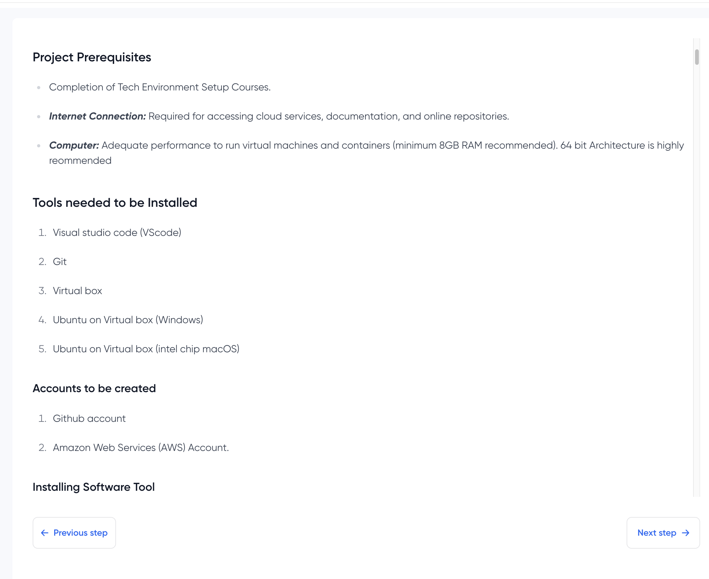

# Project Requirements

## Project Title - **TECH ENVIRONMENT SETUP**

---

### Tools to be Installed

-  **Visual Studio Code**

---

-  **Git**

---

-  **VirtualBox**

---

-  **Ubuntu (on VirtualBox)**

---

### Accounts to be Created

-  **GitHub Account**

---

-  **AWS Account**

---
