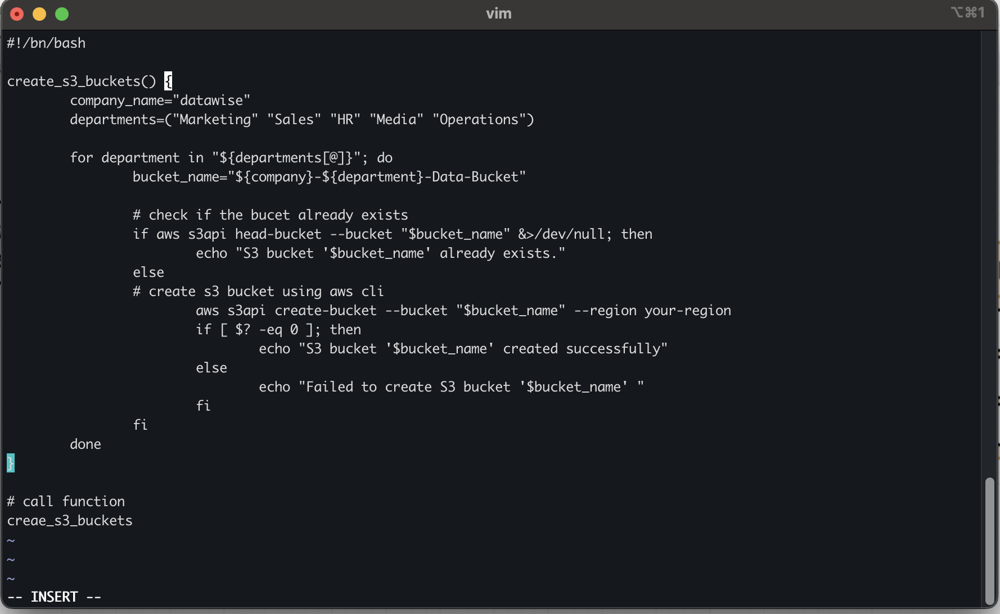
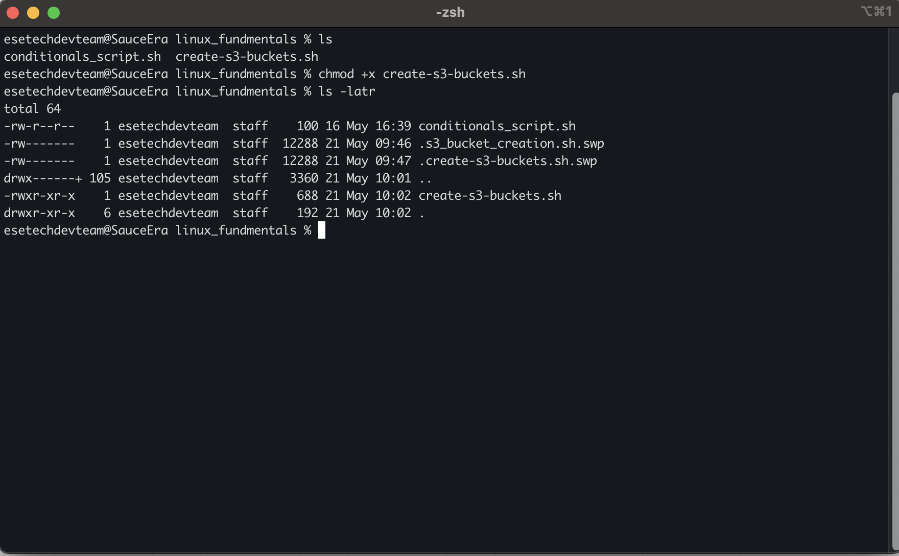

# Error Handling in Shell Scripting

Error handling in shell scripting is essential for building robust and predictable scripts, especially when performing tasks like provisioning infrastructure or automating critical processes. It ensures that failures—such as missing permissions, incorrect commands, or resource conflicts—are caught early and handled gracefully, preventing silent errors or cascading failures. One common approach is to use the special variable \$? to check the exit status of the last command, where 0 means success and any non-zero value indicates failure. By conditionally branching logic based on this status, you can display meaningful messages or stop execution if needed. For example, in the function below that creates S3 buckets for different departments, the script checks whether a bucket already exists using aws s3api head-bucket, and only attempts to create the bucket if it does not exist. After attempting creation, it checks the exit code ($?) to determine if the operation succeeded and logs the outcome accordingly. This kind of defensive scripting helps avoid duplication, ensures transparency, and makes debugging significantly easier.

## Function to create S3 buckets for different departments

```bash
create_s3_buckets() {
    company="datawise"
    departments=("Marketing" "Sales" "HR" "Operations" "Media")

    for department in "${departments[@]}"; do
        bucket_name="${company}-${department}-Data-Bucket"

        # Check if the bucket already exists
        if aws s3api head-bucket --bucket "$bucket_name" &>/dev/null; then
            echo "S3 bucket '$bucket_name' already exists."
        else
            # Create S3 bucket using AWS CLI
            aws s3api create-bucket --bucket "$bucket_name" --region your-region
            if [ $? -eq 0 ]; then
                echo "S3 bucket '$bucket_name' created successfully."
            else
                echo "Failed to create S3 bucket '$bucket_name'."
            fi
        fi
    done
}
```



