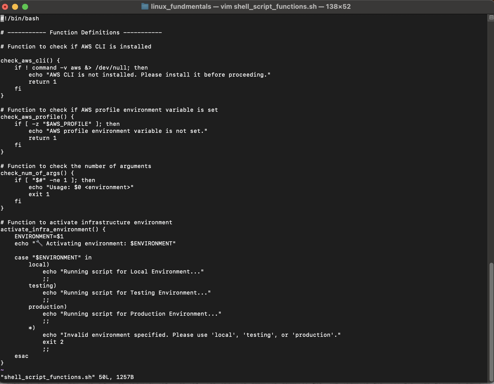

# Shell Scripting Lesson: Functions, Arguments, and Environment Variables

## Overview

In this lesson, I learned the foundational concepts of **Shell scripting**, particularly focusing on three core areas: **functions**, **arguments**, and **environment variables**. I explored how to modularize shell code using functions for better readability and reuse. I also learned how to validate and use command-line **arguments**, allowing the script to respond to different inputs dynamically. Additionally, I gained practical experience working with **environment variables**, especially for configuration and authentication tasks such as managing AWS profiles. These concepts are critical for writing maintainable, portable, and secure shell scripts for real-world DevOps and infrastructure automation tasks.

---

## Key Concepts

### Functions

Functions allow encapsulation of logic in reusable blocks. This improves script structure and readability.

### Arguments

Arguments provide a mechanism to pass external input into scripts and functions, allowing dynamic behavior based on user-provided values.

### Environment Variables

Environment variables store configuration or credentials outside the script, which is essential for secure and environment-specific scripting (e.g., `AWS_PROFILE`).

---

## Example Script



Below is a complete shell script that integrates all the concepts learned in this lesson:

```bash
#!/bin/bash

# ----------- Function Definitions -----------

# Function to check if AWS CLI is installed
check_aws_cli() {
    if ! command -v aws &> /dev/null; then
        echo "AWS CLI is not installed. Please install it before proceeding."
        return 1
    fi
}

# Function to check if AWS profile environment variable is set
check_aws_profile() {
    if [ -z "$AWS_PROFILE" ]; then
        echo "AWS profile environment variable is not set."
        return 1
    fi
}

# Function to check the number of arguments
check_num_of_args() {
    if [ "$#" -ne 1 ]; then
        echo "Usage: $0 <environment>"
        exit 1
    fi
}

# Function to activate infrastructure environment
activate_infra_environment() {
    ENVIRONMENT=$1
    echo "Activating environment: $ENVIRONMENT"

    case "$ENVIRONMENT" in
        local)
            echo "Running script for Local Environment..."
            ;;
        testing)
            echo "Running script for Testing Environment..."
            ;;
        production)
            echo "Running script for Production Environment..."
            ;;
        *)
            echo "Invalid environment specified. Please use 'local', 'testing', or 'production'."
            exit 2
            ;;
    esac
}

# ----------- Script Execution -----------

check_num_of_args "$@"
activate_infra_environment "$1"
check_aws_cli
check_aws_profile
```
