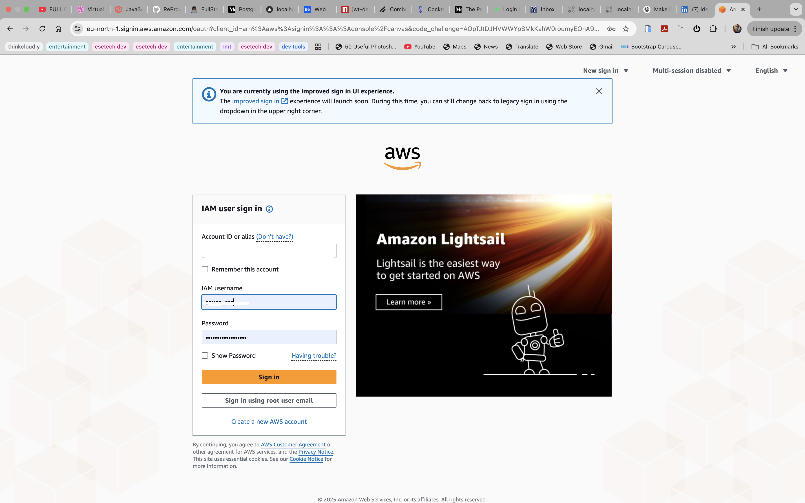
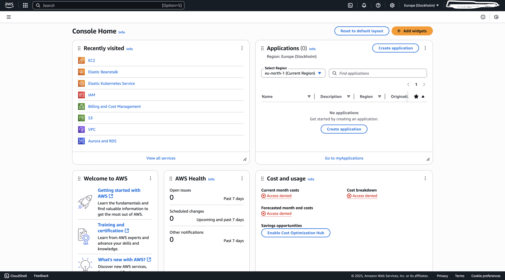

# AWS Account Setup Guide

This guide outlines why the cloud is important and provides clear, actionable steps to create an AWS account for deploying cloud-based infrastructure and applications.

---

## Why Use the Cloud?

- **On-demand Resources**: Provision servers, databases, and storage instantly.
- **Scalability**: Scale your application up or down based on demand.
- **Cost Efficiency**: Pay only for what you use. No upfront hardware investment.
- **Reliability**: High availability and redundancy across multiple regions.
- **Security**: Built-in security tools, compliance standards, and identity controls.

AWS (Amazon Web Services) is the most widely used and mature cloud provider, offering a wide range of services for developers, startups, and enterprises.

---

## How to Create an AWS Account

### 1. Go to the AWS Sign-Up Page

Visit: [https://aws.amazon.com](https://aws.amazon.com)

Click the **“Create an AWS Account”** button.

---

### 2. Enter Your Email and Set a Root Account

- Provide a valid email address
- Set a strong password
- Choose an account name (this can be your project or company name)

---

### 3. Choose Account Type

- Select **Personal** or **Business**
- Fill in your full name and phone number
- Provide a valid billing address

---

### 4. Add Payment Information

- Enter a **valid debit or credit card**
- AWS will charge a small refundable amount (usually $1) to verify your card

Note: You won’t be charged for any Free Tier services.

---

### 5. Identity Verification

- Enter your phone number
- AWS will send you a PIN code via SMS or voice call
- Enter the PIN to verify your identity

---

### 6. Select a Support Plan

Choose **Basic Support – Free**, unless you're working in a production-critical environment and need technical support.

---

### 7. Sign In to the AWS Management Console

Once your account is created and verified, log in at:

[https://console.aws.amazon.com](https://console.aws.amazon.com)

Use the **root user** (your email and password) for your first login.

---

## After Account Creation

Here’s what you should do immediately after logging in:

### 1. Set Your Region

In the top right corner of the AWS Console, select your preferred **region** (e.g., `US East (N. Virginia)` or `EU (Ireland)`).

### 2. Create an IAM Admin User (Recommended)

- Go to **IAM** (Identity & Access Management)
- Create a new user with `AdministratorAccess`
- Enable programmatic access if you plan to use CLI/SDK
- Log in using the new IAM user instead of the root account

### 3. Set Up Billing Alerts (Optional)

- Navigate to **Billing Dashboard**
- Enable billing alerts to track your Free Tier usage
- Set budgets to avoid unexpected charges

---

## Next Step

Once your account is ready, you can begin launching EC2 instances, configuring S3 storage, or deploying static sites.

