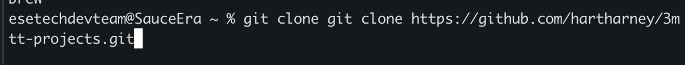
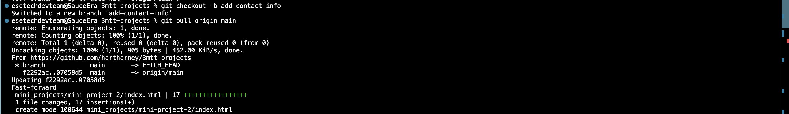
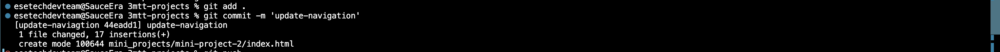
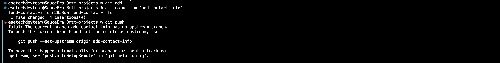
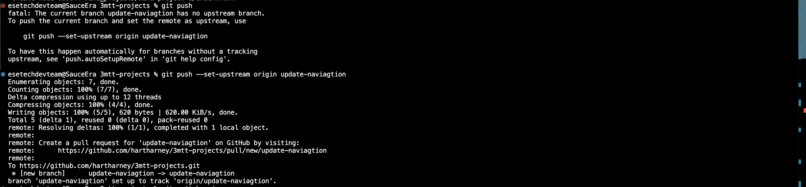
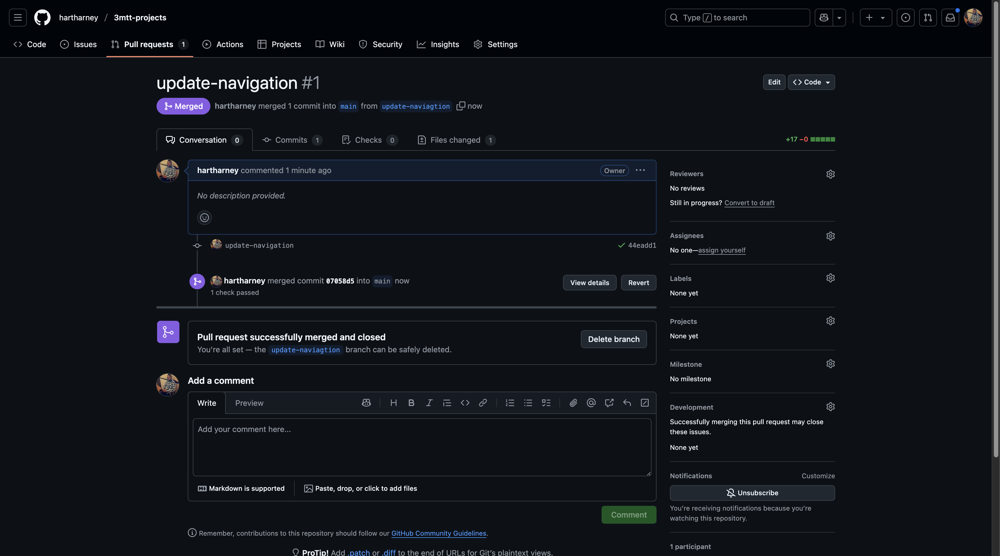
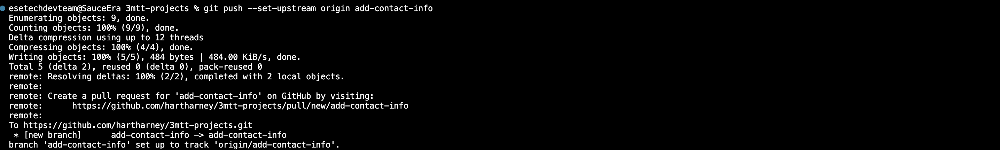
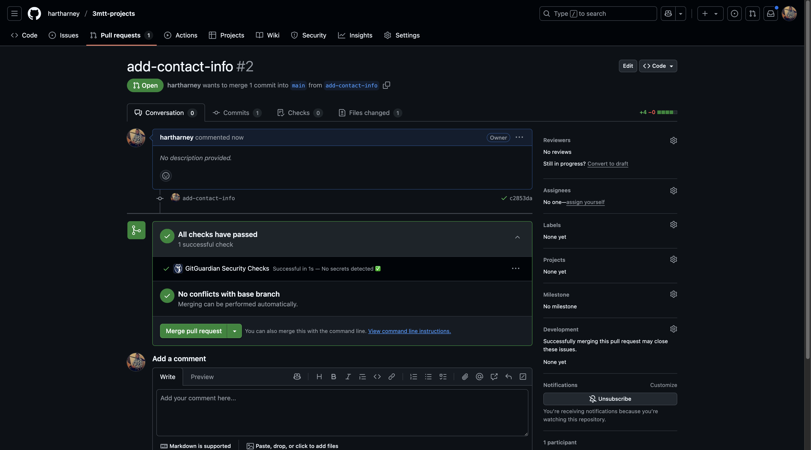
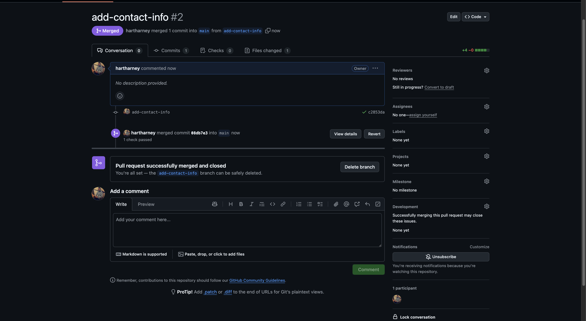
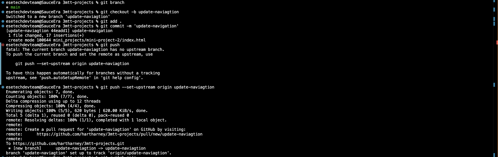

# Implementation

## Step 1: Initial setup - Tom and Jerry cloning repository.

```bash
git clone https://github.com/hartharney/3mtt-projects.git
cd 3mtt-projects/
```

🔗 

## Step 2: Tom and Jerry start working

Tom:

```bash
git pull
git checkout -b update-navigation
```

🔗 

Jerry:

```bash
git pull
git checkout -b add-contact-info
```

🔗 

## Step 3: Making changes

Tom:

```bash
git add .
git commit -m 'update-navigation'
```

🔗 

Jerry:

```bash
git add .
git commit -m 'add-contact-info'
```

🔗 

## Step 4: Merging changes

Tom:

```bash
git push --set-upstream origin update-naviagtion
```

🔗 

1. Tom creates and merges his PR
   🔗 

Jerry:

```bash
git pull origin main
git add .
git commit -m 'add-contact-info'
git push --set-upstream origin add-contact-info
```

🔗 

2. Jerry createsand merges his PR
   🔗 
   🔗 

### full set of commands

🔗 
🔗 
