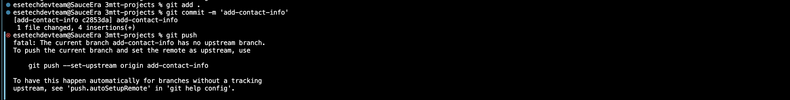

# Implementation

## Step 1: Download git

- visit the official [website](https://git-scm.com/downloads/mac)


## Step 2: Install git via CLI

- use the command :

```bash
brew install git
```


## Step 3: Confirm git installation

- run the following command

```bash
git -v
```


## Step 4: create Github profile

-visit github official [site](https://github.com/)


## Step 5: create new repository


## Step 6: Obtain url to clone repository


## Step 7: Create project directory on machine

```bash
cd Desktop/
mkdir 3mtt-projects/
cd 3mtt-projects/
```


## Step 8: Initial setup cloning repository

```bash
git clone https://github.com/hartharney/3mtt-projects.git
cd 3mtt-projects/
```

🔗 

## Step 9: Ceate index.html

```bash
    cd 3mtt-projects/
    mkdir mini-project-3
    cd mini-project-3
    touch index.html
```


## Step 10: Make changes and confim git history

```bash
 git status
```


## Step 11: Making changes

```bash
git add .
git commit -m "This is my first commit"
```

🔗 

## Step 12: First Contribution

```bash
git add .
git push origin main

```

🔗 

## Step 13: First branch

```bash
git pull
git checkout -b update-navigation
```

🔗 

## Step 14: Second commit

```bash
git add .
git commit -m 'update-navigation'
```


## Step 15: Second push

```bash
git push --set-upstream origin update-naviagtion
```


## Step 16: Second branch

```bash
git pull
git checkout -b add-contact-info
```


## Step 17: Third commit

```bash
git add .
git commit -m 'add-contact-info'
```



## Step 18: Merging changes

Tom:

```bash
git push --set-upstream origin update-naviagtion
```


