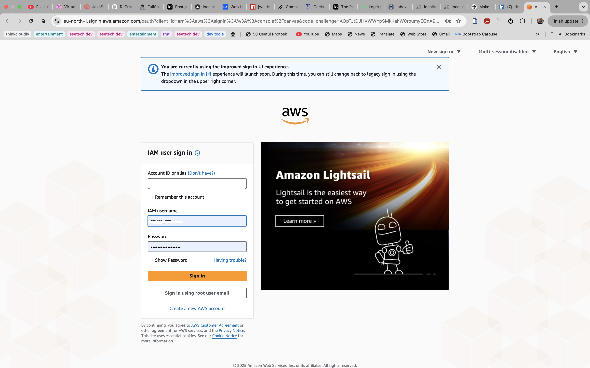
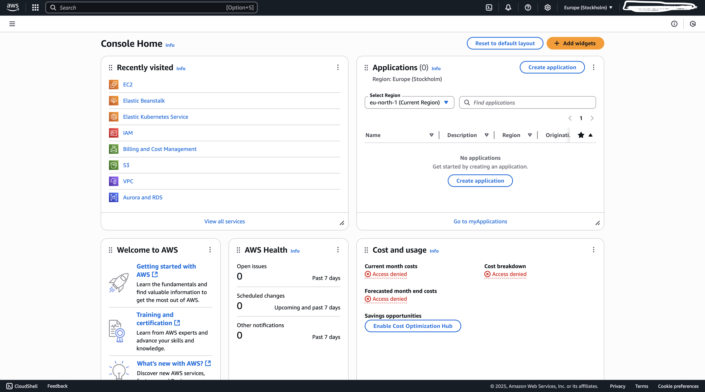
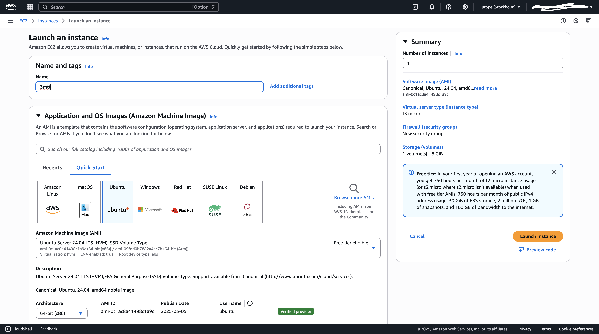
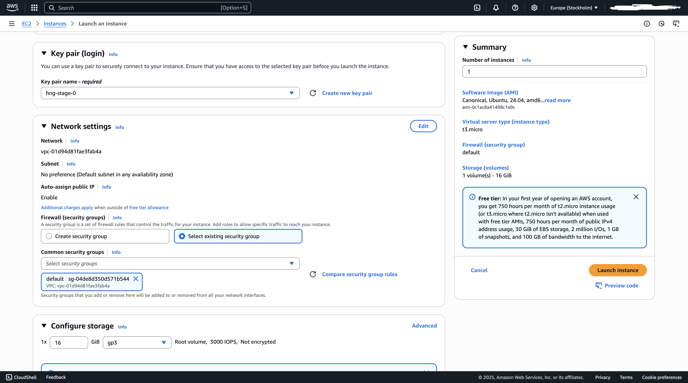
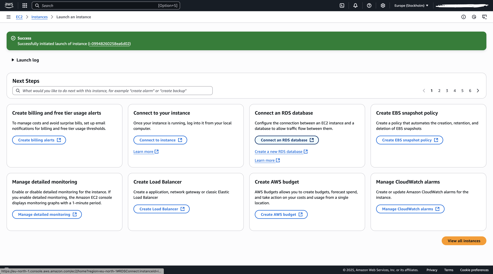
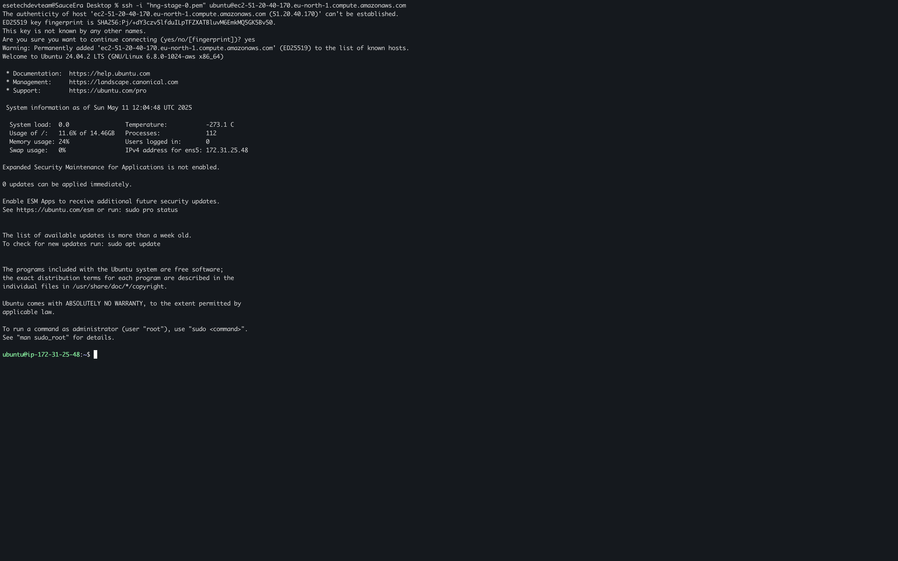
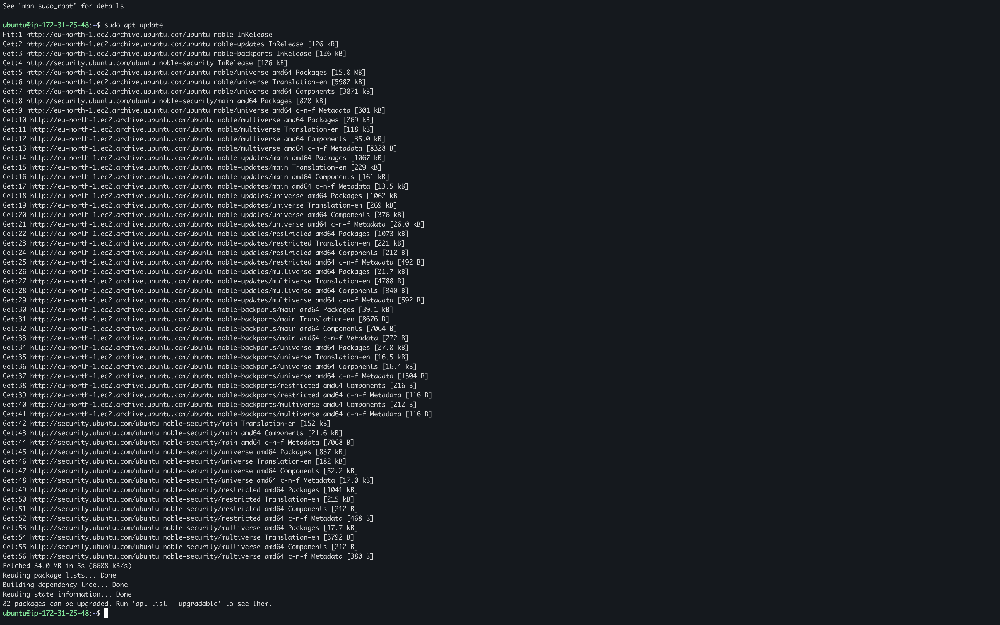
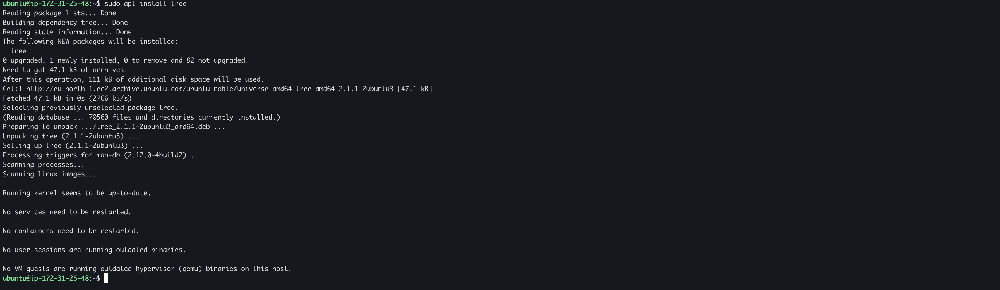
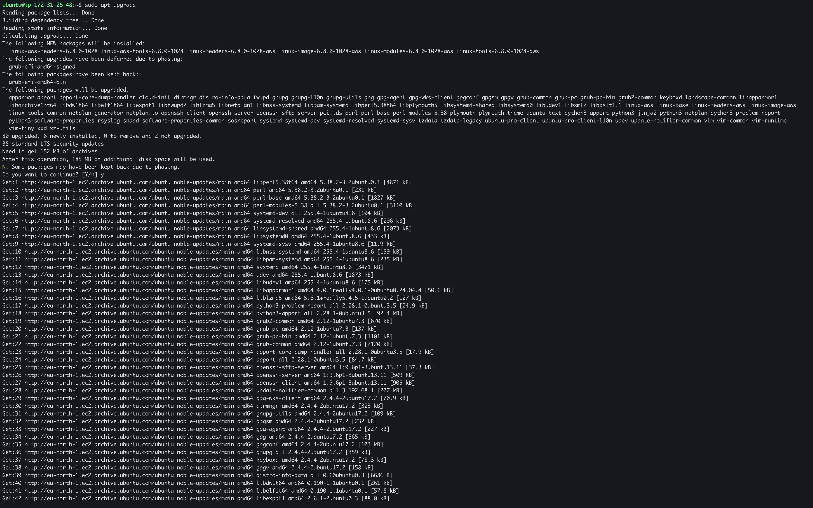
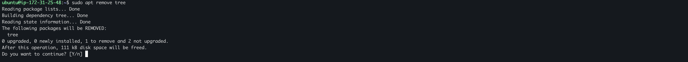

# Implementation

## Step 1: AWS console login

- visit the amazon aws [website](https://aws.amazon.com)



## Step 2: Find EC2 on the console



## Step 3: EC2 Instance Setup



## Step 4: EC2 instance Network Settings



## Step 5: Launch EC2 Instance



## Step 6: SSH Client Remote Login

> Open your terminal
> cd into directory with pem key
> use the SSH client
> connect to the instance

```bash
ssh -i "ubuntu.pem" ubuntu@public_ip_address
```



## Step 7: sudo apt update

> update package list

```bash
sudo apt update
```



## Step 8: sudo apt install

> install tree package to view directory tree structure

```bash
sudo apt install tree
```



## Step 9: sudo apt upgrade

> update installed packages

```bash
sudo apt upgrade
```



## Step 10: sudo apt remove

```bash
sudo apt remove tree
```

> remove an installed package


