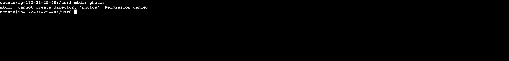
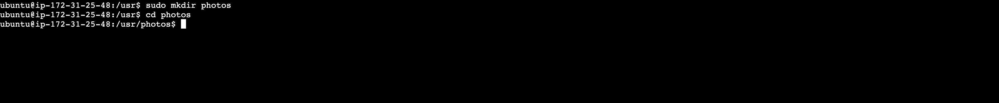
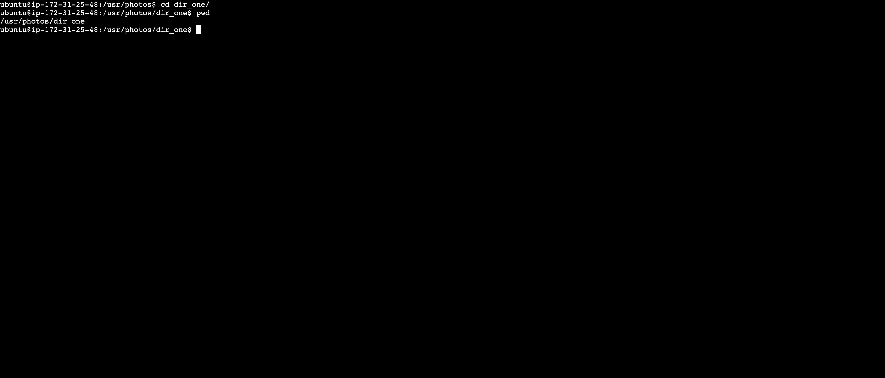
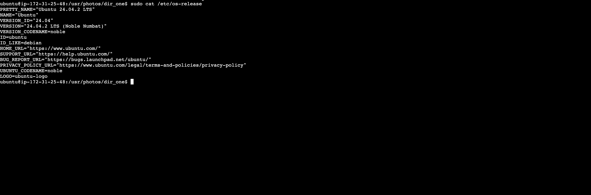
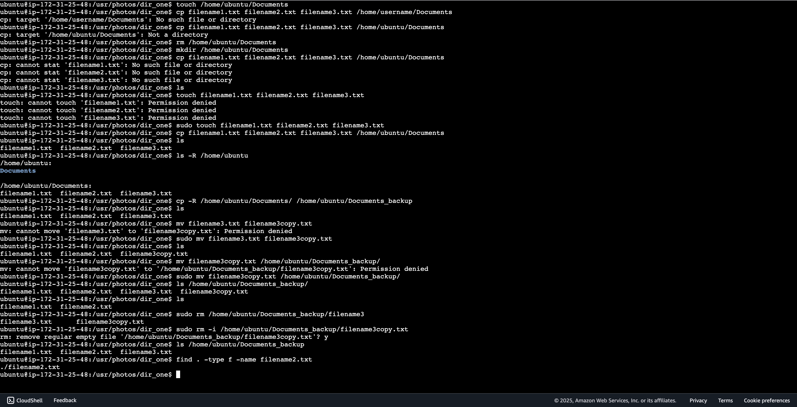

# Implementation

## Step 1: Create Directory called "photos" inside /usr dir

> ```bash
> mkdir /usr/photos
> ```



## Step 2: Navigate to photos directory

> ```bash
> sudo mkdir /usr/photos
> cd /usr/photos
> ```



## Step 3: Create 3 directories inside the photos dir and show created dir

> ```bash
> sudo mkdir dir_one dir_two dir_three
> ls
> ```


## Step 4: Navigate into one of them and show full path

> ```bash
> cd dir_one/
> pwd
> ```



## Step 5: print contents of a file to stndout

> ```bash
> sudo cat /etc/os-release
> ```



## Step 6: other commands

> Create document
> Copy documents from one directory to another
> Delete documents and directories
> Rename and move a file
> find a file


