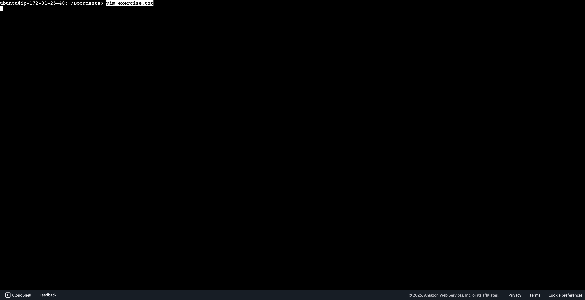
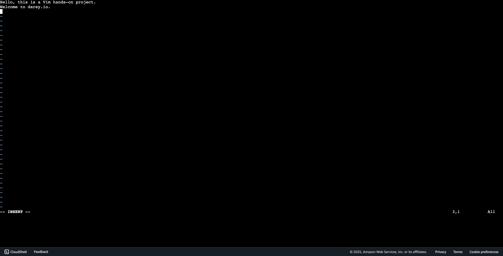
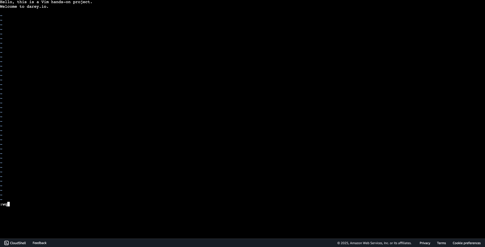
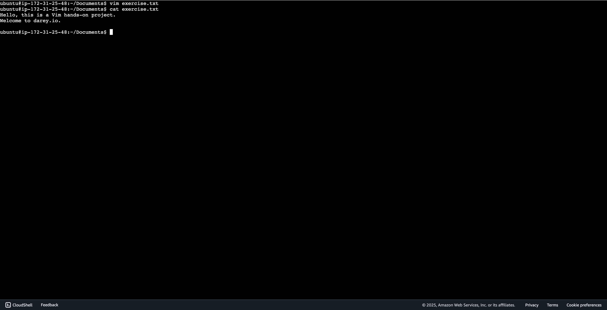
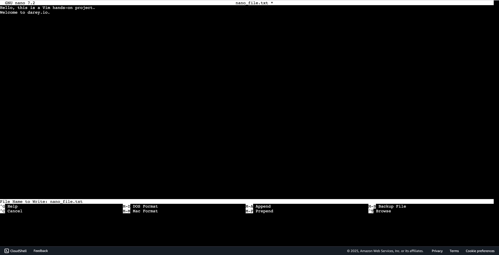
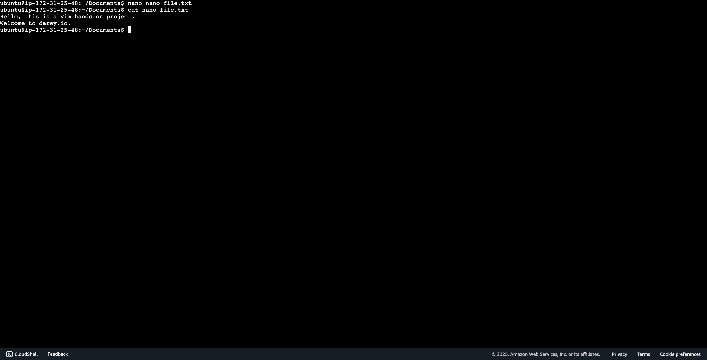

# Implementation

## Step 1: Create file using Vim

> ```bash
> vim exercise.txt
> ```



## Step 2: Edit file using Vim

> press the `i` key to enter insert mode



## Step 3: saving files on Vim

> press `esc` key then type ":wq" to save and exit editor



## Step 4: Printing the content of the edited file

> ```bash
> cat exercise.txt
> ```



## Step 5: Editing and saving file in Nano

> ```bash
> nano nano_file.txt
> ```

> Start typing, when done press the keys `ctrl` + `o` to save.
> A promt will appear, press `enter` to confirm file name.
> Press `ctrl` + `x` to save and exit.
> A promt will appear, press `enter` to confirm file name.



## Step 6: View contents of file

> ```bash
> cat nano_file.txt
> ```


