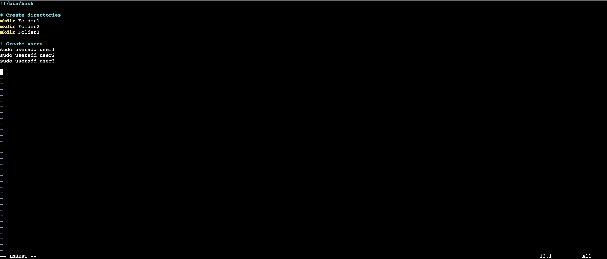
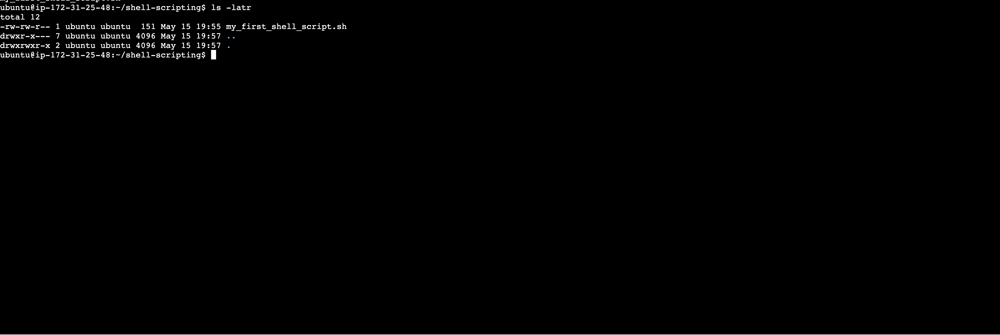
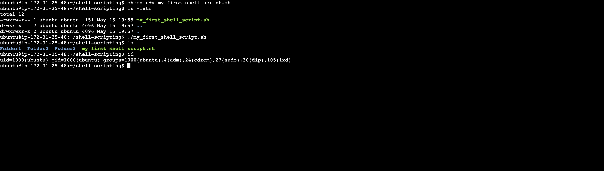

# Implementation Shell Scripting fundamentals

## Step 1: Create Directory using mkdir and Create file using Vim

> ```bash
> mkdir shell_scripting
> vim my_first_shell_script.sh
> ```


## Step 2: Edit file using Vim

> press the `i` key to enter insert mode



## Step 3: View file permissions

> ```
> ls -latr
> ```



## Step 4: Update file permissions

> modify user (owner) permission to add executable permission and execute script

> ```bash
> chmod u+x my_first_shell_script.sh
> ./my_first_shell_script
> ```



## Step 5: Working with variables

> ```bash
> name="john"
> echo $name
> echo my name is $name
> ```


