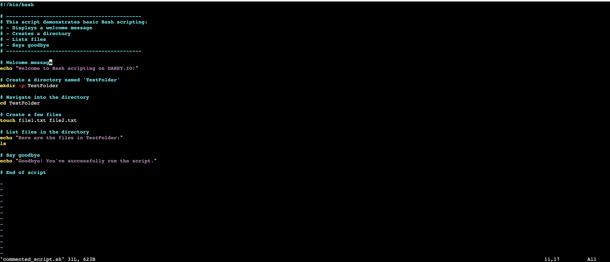

# Implementation - Comments

## Step 1: Create script

> ```bash
> touch commented_script.sh
> vim commented_script.sh
> ```



## Step 2: Execute file

> ```
> chmod u+x commented_script.sh
> ./commented_script.sh
> ```


