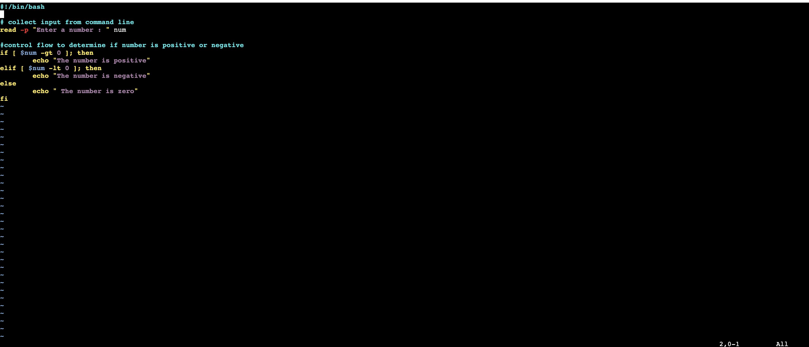
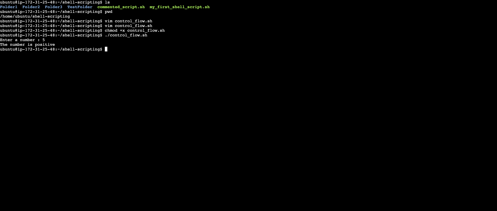
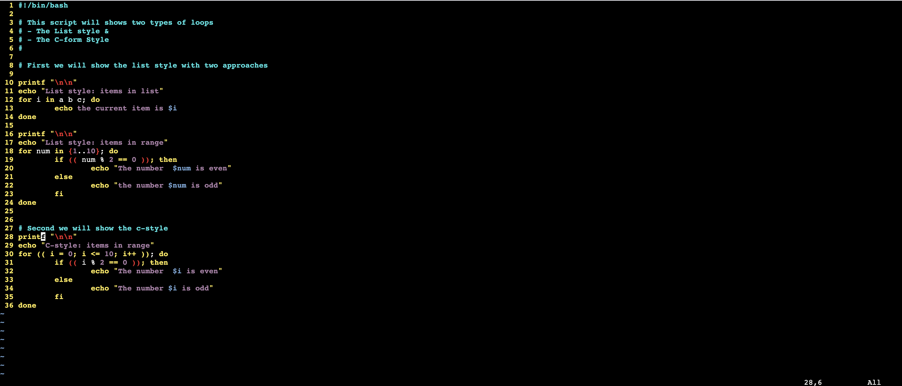
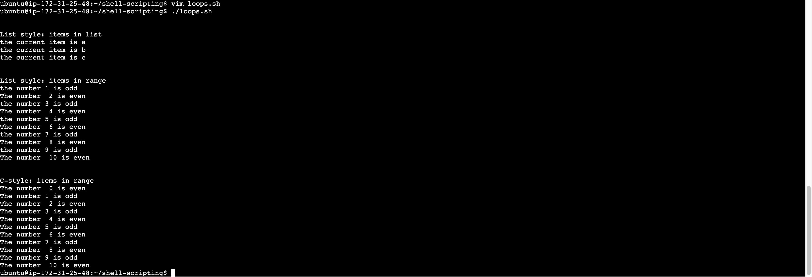

# Implementation Shell Scripting fundamentals

## Step 1: Create and edit script showing control flow

> ```bash
> vim control_flow.sh
> chmod +x control_flow.sh
> ```



## Step 2: Execute control flow



## Step 3: Create and edit script showing loops

> ```
> vim loops.sh
> chmod +x loops.sh
> ```




